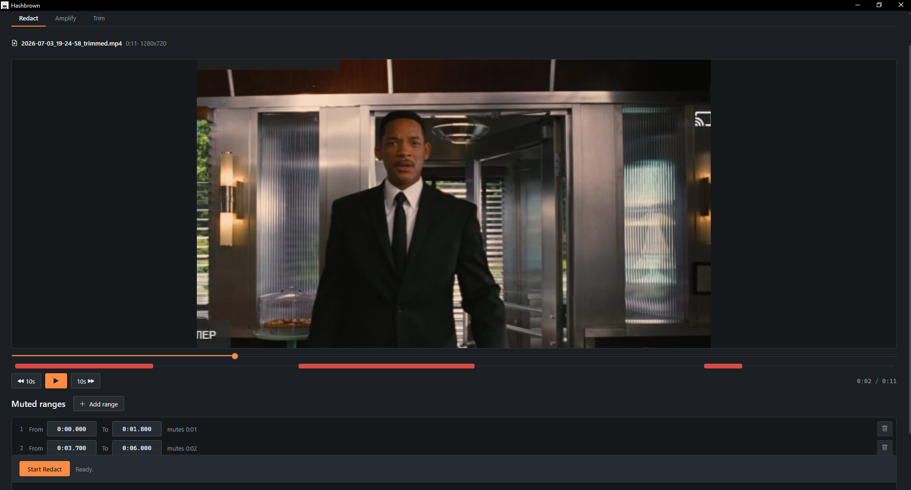
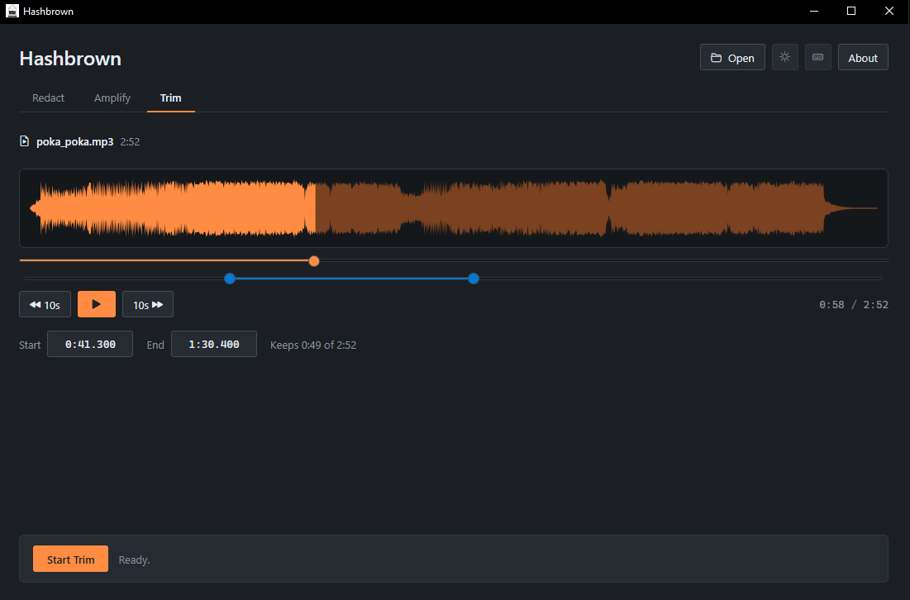
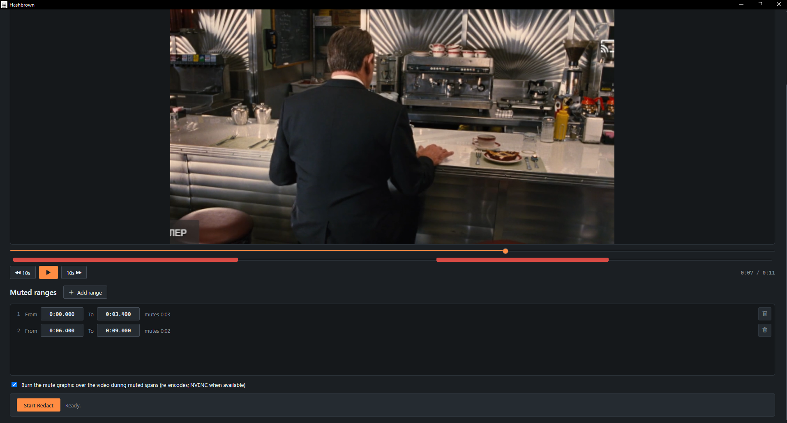
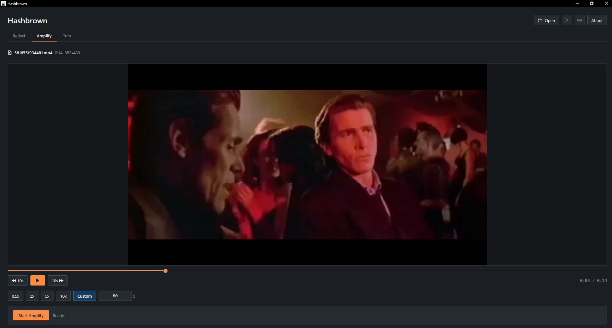
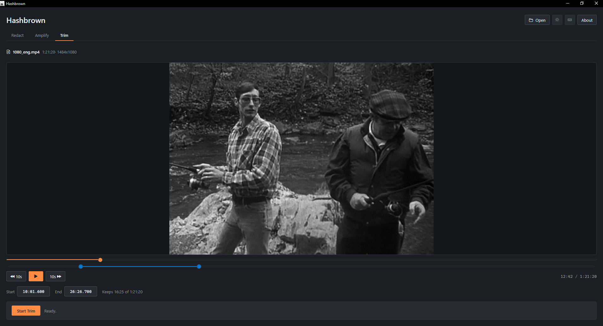
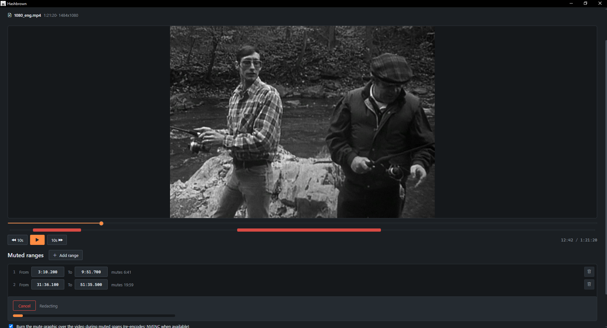
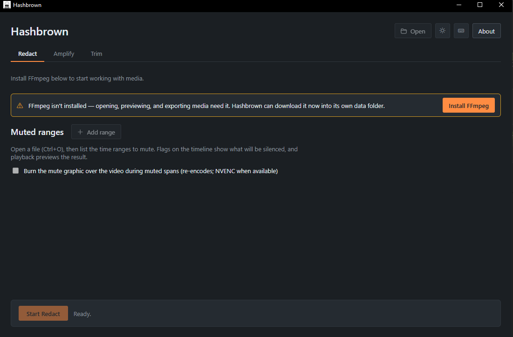

# Hashbrown

Hashbrown prepares digital-media evidence for disclosure. An examiner opens an
audio or video file, then **redacts** it (mutes time ranges, optionally branding
them with a mute graphic), **amplifies** it (changes loudness), or **trims** it
(keeps a single span) - previewing the exact result in the built-in player
before exporting a new file to a location of their choosing. The original file
is only ever read, a cancelled export never leaves a half-written file behind,
and the app makes no network request except an explicit, confirmed download of
the FFmpeg toolchain it runs on.

Built for Iceberg Forensics LLC and the Westchester County District Attorney's
Office High Tech Crime Bureau.



## Table of contents

- [Hashbrown](#hashbrown)
  - [Table of contents](#table-of-contents)
- [User guide](#user-guide)
  - [Installation](#installation)
  - [Quick start](#quick-start)
  - [The main window](#the-main-window)
  - [Opening a file](#opening-a-file)
  - [The player](#the-player)
  - [The Redact tab](#the-redact-tab)
  - [The Amplify tab](#the-amplify-tab)
  - [The Trim tab](#the-trim-tab)
  - [Exporting](#exporting)
  - [The media toolchain (ffmpeg)](#the-media-toolchain-ffmpeg)
  - [Theme](#theme)
  - [Where your data lives](#where-your-data-lives)
  - [Keyboard shortcuts](#keyboard-shortcuts)
  - [Troubleshooting](#troubleshooting)
- [Developer guide](#developer-guide)
  - [Run from source](#run-from-source)
  - [Architecture](#architecture)
  - [FFmpeg command reference](#ffmpeg-command-reference)
  - [Repository layout](#repository-layout)
  - [Testing](#testing)
  - [Versioning, CI, and release](#versioning-ci-and-release)
  - [License](#license)

---

# User guide

## Installation

Hashbrown is a desktop application for Windows, macOS, and Linux.

- **Windows**: run the provided installer (`.msi` or the NSIS `.exe`). The app
  renders in the system WebView2 runtime.
- **macOS**: open the `.dmg` and drag the app to Applications.
- **Linux**: install the `.deb`, or run the `.AppImage` directly.

The only other software Hashbrown needs is **FFmpeg**, and it installs that
itself on first run, from inside the app, after you confirm - see
[The media toolchain (ffmpeg)](#the-media-toolchain-ffmpeg). If your machine
already has ffmpeg on the `PATH`, nothing is downloaded.

If you received the repository instead of an installer, build it yourself -
see [Run from source](#run-from-source).

## Quick start

1. Launch the app. If FFmpeg isn't found, a banner offers a one-click install -
   media actions stay disabled until the toolchain is present, so the banner is
   the way forward.
2. Pick the tab for what you want to do: **Redact**, **Amplify**, or **Trim**.
3. Press `Ctrl+O` and select a video or audio file. The file is probed and
   loaded into the player.
4. Set up the edit - muted ranges, a loudness multiplier, or a span to keep -
   and **play the file to preview it**: what you hear and see in the player is
   what will export.
5. Click the tab's big **Start** button, choose where to save the output in the
   native Save dialog (a sensible name is pre-filled), and watch the progress
   bar. A running job can be cancelled at any time; cancelling deletes the
   partial output file.

The original file is never modified - every export writes a **new** file to the
location you choose.

## The main window

Top to bottom:

- **Tab bar** - the three tools: **Redact**, **Amplify**, **Trim**. One media
  file is open at a time (the session), shared by all tabs; switching tabs
  keeps the file loaded.
- **Player** - the shared media player with its timeline (see
  [The player](#the-player)). Each tab adds its own controls on and below it.
- **Tab footer** - the tab's **Start** button and progress bar; Start becomes a
  **Cancel** affordance while a job runs.

The title bar area also holds the theme toggle and the About panel (version and
bundled license texts), and `F1` opens the keyboard-shortcuts list. The layout
reflows rather than clips down to a 600x650 window.

## Opening a file

Press `Ctrl+O`. The open dialog filters to known media extensions; both video
and audio files are accepted on every tab. After you pick a file, Hashbrown
probes it (duration, dimensions) with ffprobe and loads it into the shared
session. Opening another file replaces the session.

## The player

Every tab shares one player:

- **Timeline / scrubber** with click-to-seek and a current-time readout.
- **Play/pause** (`Space`) and **10-second skip** back / forward (`<-` / `->`).
- **Audio-only files** compact the stage to the file's actual waveform -
  peaks are extracted by ffmpeg, the played portion fills in the accent color,
  and clicking the waveform seeks. An animated equalizer strip stands in while
  peaks extract.
- **Undecodable formats** (codecs the webview can't play, e.g. HEVC) degrade to
  a "preview unavailable" notice without closing the session - the edit
  controls and export still work, because exporting goes through FFmpeg, not
  the player.



## The Redact tab

The headline feature: silence one or more time ranges so the file can be shared
without exposing protected material.



- **The timeframe list** below the player is the source of truth. Each row is
  one muted region with **From** and **To** fields, edited to `m:ss.mmm`
  precision. Rows are added and removed only in the list.
- **Timeline flags** mark the muted spans directly on the player timeline.
  Flags can be **moved** (drag the body; length preserved) and **resized**
  (drag an edge handle) - the list row updates live either way.
- **Live preview**: during playback, the listed ranges are actually muted, so
  you hear the redacted result before exporting.
- **Mute-graphic overlay** (toggle): when on, a mute icon is burned over the
  video during muted spans - this forces a re-encode, using NVIDIA NVENC
  hardware encoding when a capable GPU is present and `libx264` otherwise.
  When off, only the audio is silenced and the video stream is copied
  untouched (fast, lossless video). The toggle is disabled for audio-only
  files.
- Ranges are validated and normalized before export - clamped to the media
  duration, inverted bounds fixed, empty selections rejected.
- **Export** suggests `<name>_redacted.<ext>`.

## The Amplify tab

Changes loudness without touching the video stream.



- **Five choices**: `0.5x`, `2x`, `5x`, `10x`, or **Custom** - a free numeric
  multiplier with live validation.
- **Live preview**: while the Amplify tab is active, playback applies the
  selected multiplier, so what plays is what exports.
- Audio is re-encoded **container-aware** (mp3 -> libmp3lame, wav -> pcm,
  flac -> flac, ogg -> vorbis, opus/webm -> opus, otherwise AAC), so both video
  files and audio-only files come out with a valid container. Video streams
  pass through untouched.
- **Export** suggests `<name>_vol.<ext>`.

## The Trim tab

Keeps a single span of the file and discards the rest.



- **A two-handle range slider** on the player timeline marks the start and end
  of the span to keep; **numeric timecode fields** (`m:ss.mmm`) below the
  player take precise values.
- **Live preview**: playback is confined to the selection - play starts inside
  it, seeks clamp to it, and playback pauses at the span's end.
- **Validation** - start before end, end within the duration, a minimum
  length - with clear error states; export is blocked until the range is valid.
- The export is a **lossless stream copy** (no re-encode), so it is fast and
  bit-faithful; progress is measured against the selected duration.
- **Export** suggests `<name>_trimmed.<ext>`.

## Exporting

Every tab exports the same way:

- **Start** opens a native **Save As** dialog. You choose the destination
  folder and filename; Hashbrown pre-fills the source name plus a per-tab
  suffix (`_redacted`, `_vol`, `_trimmed`) and keeps the original extension.
- The job runs in the background with a **determinate progress bar** - Trim
  reports against the selected duration, Redact and Amplify against the probed
  file duration - so the bar fills accurately even on hour-long evidence.
- **Cancel** stops the job and **deletes the partial output file**, so no
  half-written media is ever left behind.
- If FFmpeg fails, the error surfaces with the tail of FFmpeg's own output, so
  the cause is diagnosable rather than a bare "export failed".



## The media toolchain (ffmpeg)

**FFmpeg** is the widely used open-source media engine Hashbrown drives for
every probe, preview waveform, and export. Hashbrown does not bundle it:

- At launch, the app looks for `ffmpeg`/`ffprobe` on the system `PATH`, then in
  its own data directory (on Windows,
  `%LOCALAPPDATA%\IcebergForensics\Hashbrown\data\bin\`).
- If neither is found, a **banner** offers a one-click download and install:
  determinate download progress, cancellable, with a Retry on failure (network
  errors, bad archives, and missing binaries all fail loudly rather than
  half-install). Until the toolchain is present, media actions - including
  Open - are disabled.
- **This is the only network request the application ever makes**, and it
  happens only when you click install. A deployment behind a mirror can
  override the download URLs in `config.toml` (`[ffmpeg]`).
- After a successful install the banner drops and any open-but-unprobed file is
  probed automatically - no need to reopen anything.



## Theme

Dark theme is the default; a title-bar toggle switches to light. The choice
persists across runs (stored in the app's `config.toml`).

## Where your data lives

- **The source file** is only ever read - never modified, moved, or deleted.
  Every export writes a new file to a location you choose.
- **Application settings** (`config.toml` - theme, FFmpeg download URLs) live
  in the per-user OS config directory. A missing or corrupted config is never
  fatal: the app falls back to defaults and rewrites it on the next change.
- **Downloaded FFmpeg binaries** live in the per-user app data directory.
- **Logs** are plain-text files in the app data directory, rotated daily. The
  frontend's console output - including uncaught errors - is mirrored into the
  same file, so one greppable log traces a full chain of actions across UI and
  engine. Nothing - logs, telemetry, crash reports, anything - ever leaves the
  machine.

## Keyboard shortcuts

| Shortcut | Action |
|----------|--------|
| `Ctrl+O` | Open a media file |
| `Space` | Play / pause |
| `<-` / `->` | Skip 10 seconds back / forward |
| `<-` / `->` | Switch tab (when the tab bar is focused) |
| `F1` | Show the keyboard-shortcuts list |
| `Esc` | Close dialog |

## Troubleshooting

- **A banner says FFmpeg is missing / Open is disabled** - install the
  toolchain from the banner; see
  [The media toolchain (ffmpeg)](#the-media-toolchain-ffmpeg). If the download
  fails, the banner shows the reason and offers Retry.
- **"Preview unavailable" but the file opened** - the webview can't decode that
  codec (iPhone `.mov` files are typically HEVC). The edit controls and export
  still work: exports run through FFmpeg, not the player.
- **Redact export is slow** - the mute-graphic overlay forces a re-encode. Turn
  the overlay off for an audio-only mute with lossless (stream-copied) video,
  or expect re-encode speed - with an NVENC-capable NVIDIA GPU the re-encode is
  hardware-accelerated automatically.
- **An export was cancelled - where's the file?** - deleted, deliberately. A
  cancelled or failed export never leaves a partial file.
- **Something misbehaved** - check the newest log file in the app data
  directory; frontend and engine log into the same daily file.

---

# Developer guide

## Run from source

Prerequisites: a [Rust toolchain](https://rustup.rs), [Node.js](https://nodejs.org) 20+,
and the [Tauri prerequisites](https://tauri.app/start/prerequisites/) for your OS
(on Linux, the WebKitGTK dev packages; on Windows/macOS the system webview is built in).

```powershell
npm install          # once, to pull frontend deps
npm run tauri dev    # run the app with hot-reload
```

`npm run tauri dev` starts the Vite dev server and the Rust shell together;
edits to Svelte/CSS hot-reload, edits to Rust trigger a recompile.

FFmpeg is optional at dev time exactly as it is for users - the install banner
works in dev, or put `ffmpeg`/`ffprobe` on your `PATH`.

## Architecture

A Cargo workspace of two Rust crates plus a Svelte frontend. `hashbrown-core`
holds all logic - the session model, the amplify/redact/trim job runners, FFmpeg
process management and toolchain download, waveform extraction, config, logging,
paths - and depends on no UI or Tauri code, so it is tested headless. `src-tauri`
is a thin Tauri shell that wires `#[tauri::command]`s to the core and owns window
setup, capabilities, and the CSP; jobs stream typed progress over a
`tauri::ipc::Channel` and are cancellable through a token registry. `frontend/`
is the Svelte 5 + TypeScript app, which reaches Rust only through the typed IPC
wrappers in `lib/ipc.ts`; the Rust side owns truth and the webview is a
projection of it. `Cargo.toml` and `package.json` stay at the root (the
`cargo`/`tauri`/npm CLIs resolve their code dirs from there); everything else is
grouped under the three code peers.

## FFmpeg command reference

Every ffmpeg/ffprobe invocation the app makes, exactly as the core builds it.
Placeholders in `<angle brackets>`; everything else is literal. All commands run
with no console window on Windows (`CREATE_NO_WINDOW`). Every export job also
passes `-progress -` so FFmpeg streams machine-readable progress on stdout; the
core parses the `out_time_us=` lines into progress ticks and keeps a 20-line
stderr ring buffer for the error message if the job fails
(`service/process.rs`).

**Tool detection** (`service/ffmpeg_manager.rs`, `find_tool`) - probes whether a
tool exists on `PATH` before falling back to the app's local bin directory:

```
ffmpeg -version
ffprobe -version
```

**Duration probe** (`service/metadata.rs`, `probe_duration`) - run on open and
at the start of Redact/Amplify jobs to size the progress bar; output is seconds,
parsed to milliseconds:

```
ffprobe -v error -show_entries format=duration -of default=noprint_wrappers=1:nokey=1 <input>
```

**Dimensions probe** (`service/metadata.rs`, `probe_dimensions`) - the
capital-`V` stream specifier matches only real video streams, so audio files
with embedded cover art still probe as audio-only (empty output = `(0, 0)`):

```
ffprobe -v error -select_streams V:0 -show_entries stream=width,height -of csv=s=x:p=0 <input>
```

**NVENC detection** (`service/ffmpeg_manager.rs`, `detect_nvenc`) - run once
per process and cached. Encodes a 0.1-second black test pattern to the null
muxer, walking up through sizes `32x32`, `64x64`, `128x128`, `144x144`,
`192x192`, `256x256`, `320x240`, `640x480` until one succeeds (NVENC available)
or the stderr shows an NVENC/driver error (unavailable):

```
ffmpeg -f lavfi -i color=black:s=<WxH>:d=0.1 -c:v h264_nvenc -f null -
```

**Waveform peaks** (`service/waveform.rs`, `extract_peaks`) - decodes the audio
to mono 8 kHz s16le PCM streamed over stdout, which the core folds into a fixed
number of peak buckets as it arrives (constant memory, any input format; `-vn`
skips video and cover art):

```
ffmpeg -hide_banner -v error -i <input> -vn -ac 1 -ar 8000 -f s16le -
```

**Trim** (`service/trim.rs`, `run_trim`) - pure stream copy, no re-encode;
`<start>`/`<end>` are seconds with millisecond precision (e.g. `12.345`):

```
ffmpeg -hide_banner -y -ss <start> -to <end> -i <input> -progress - -c copy <output>
```

**Amplify** (`service/amplify.rs`, `run_amplify`) - video (if any) is stream
copied; audio is filtered and re-encoded with the container-matched codec
(`<mult>` has two decimals, e.g. `2.00`):

```
ffmpeg -hide_banner -y -i <input> -progress - -c:v copy -af volume=<mult> -c:a <acodec> <acodec-opts> <output>
```

**Redact, overlay off** (`service/redact.rs`, `run_redact`) - video stream
copied untouched; the audio filter zeroes the volume only inside the muted
ranges. `<when>` is the segment list joined with `+`, one
`between(t,<start>,<end>)` per muted range (seconds, three decimals), e.g.
`between(t,5.000,9.500)+between(t,20.000,31.250)`:

```
ffmpeg -hide_banner -y -i <input> -progress - -c:v copy -af volume=enable='<when>':volume=0 -c:a <acodec> <acodec-opts> <output>
```

**Redact, overlay on** (`service/redact.rs`) - the bundled `mute_icon.png`
(written to a temp file for the run, deleted after) is a second input, scaled to
one fifth of the video height (`<icon>` = height/5; 1080p is assumed if the
probe can't say) and overlaid at `10:10` during the muted ranges while the same
ranges are silenced; the re-encode uses NVENC when
[detection](#ffmpeg-command-reference) found it, `libx264` otherwise:

```
ffmpeg -hide_banner -y -i <input> -progress - -i <mute_icon.png> \
  -filter_complex "[1:v]scale=<icon>:-1[img]; [0:v][img]overlay=10:10:enable='<when>'[vout]; [0:a]volume=enable='<when>':volume=0[aout]" \
  -map [vout] -map [aout] \
  -c:v h264_nvenc -preset p4 -cq 24 \        (NVENC path)
  -c:v libx264 -preset fast -crf 23 \        (software path)
  -c:a <acodec> <acodec-opts> <output>
```

**Audio preview segment** (`service/amplify.rs`, `generate_preview`) - present
in the core but not wired to any UI: renders a fast audio-only MP3 excerpt
(`-vn` drops video); the `-af` is included only when a multiplier is given:

```
ffmpeg -hide_banner -y -ss <start> -i <input> -t <seconds> [-af volume=<mult>] -c:a libmp3lame -q:a 2 -vn <output.mp3>
```

`<acodec> <acodec-opts>` is chosen from the destination extension by
`audio_codec_for` in `service/amplify.rs` (shared by Amplify and Redact):

| Extension | Codec arguments |
|-----------|-----------------|
| `.mp3` | `-c:a libmp3lame -q:a 2` |
| `.wav` | `-c:a pcm_s16le` |
| `.flac` | `-c:a flac` |
| `.ogg`, `.oga` | `-c:a libvorbis -q:a 5` |
| `.opus`, `.webm` | `-c:a libopus -b:a 128k` |
| anything else (mp4, mkv, mov, m4a, ...) | `-c:a aac -b:a 128k -ar 44100` |

## Repository layout

```
Hashbrown/
|-- Cargo.toml                 # Rust workspace; shared dep versions; release profile
|-- package.json               # frontend deps + scripts (dev -> vite frontend, tauri)
|-- VERSION                    # canonical version; scripts/version.js propagates it
|-- hashbrown-core/            # all logic; no UI/Tauri deps; testable headless
|   |-- assets/                # mute_icon.png, burned in by the redact overlay
|   |-- src/
|   |   |-- lib.rs, app.rs, error.rs
|   |   |-- model/             # serde data types (session, redaction)
|   |   `-- service/           # amplify, redact, trim, metadata, waveform,
|   |                          #   ffmpeg_manager, process, task (Progress +
|   |                          #   cancel), config, logging, paths, ...
|   `-- tests/                 # integration tests + fixtures
|-- src-tauri/                 # Tauri shell (thin Rust); the only crate linking Tauri
|   |-- src/{main.rs,lib.rs,commands.rs,dto.rs,error.rs}
|   |-- capabilities/          # least-privilege permission grants
|   |-- icons/                 # generated by `tauri icon`
|   `-- tauri.conf.json        # window, CSP + asset-protocol scope, bundling
|-- frontend/                  # Svelte 5 + TypeScript app (Vite root)
|   |-- index.html, vite.config.ts, svelte.config.js, tsconfig.json
|   `-- src/
|       |-- App.svelte, main.ts
|       |-- styles/{theme.css,global.css}     # design tokens
|       |-- lib/
|       |   |-- ipc.ts, log.ts, session.svelte.ts, theme.ts, types.ts,
|       |   |     format.ts                    # IPC, console->Rust bridge, session
|       |   |-- components/                    # Player, Waveform, RangeSlider,
|       |   |                                  #   SegmentFlags, JobRunner,
|       |   |                                  #   ProgressBar, FfmpegBanner, ...
|       |   `-- views/                         # RedactView, AmplifyView, TrimView
|       `-- assets/            # fonts, bundled license texts
|-- scripts/                   # version.js, generate-credits.js
|-- .github/workflows/         # CI: checks.yml + release.yml (self-hosted runners)
|-- FEATURES.md                # the authoritative feature list
|-- analysis_todo.md           # in-repo backlog
|-- LICENSE.txt
`-- STANDARDS.md               # the workspace's engineering standards
```

## Testing

- `cargo test --workspace` - core and shell tests, headless (no FFmpeg or UI
  needed for the unit level; fixtures live under `hashbrown-core/tests/`).
- `npm run check` - `svelte-check` over the frontend TypeScript.
- `npm run test` - Vitest for the frontend's pure logic (e.g. timecode
  parsing in `format.ts`).
- `cargo fmt --all --check` and
  `cargo clippy --workspace --all-targets -- -D warnings` must also pass -
  CI enforces both.

Real media for manual runs lives in `test_video/` (a small `.mkv` and `.mp3`
plus exported variants).

## Versioning, CI, and release

The version lives in one file - `VERSION` - and is propagated into
`Cargo.toml`, `package.json`, `package-lock.json`, and `tauri.conf.json` by
`node scripts/version.js sync` (`version:check` verifies they agree; CI runs
it).

**Checks** (`checks.yml`) run on every push to `main`, on self-hosted Windows
and Linux runners (macOS currently disabled): version sync, `cargo fmt`,
`clippy` with warnings denied, `cargo test`, and `svelte-check`.

**Release** (`release.yml`) is cut either by pushing a `vX.Y.Z` tag or by
running the workflow manually with a patch/minor/major bump - either way the
version files are updated mechanically and platform bundles are built and
published as a GitHub Release:

```powershell
npm run tauri build   # local equivalent; bundles land in src-tauri/target/release/bundle/
```

That produces the `.msi` + NSIS `.exe` on Windows, `.dmg` + `.app` on macOS,
and `.deb` + `.AppImage` on Linux.

`npm run gen-license` regenerates the third-party credits file the About panel
displays (`frontend/src/assets/generated-licenses.txt`) by scanning the JS
runtime deps in `node_modules` and, when `cargo-about` is installed, the Rust
dependency tree (config in `about.toml`). It is best-effort by design - a
missing tool degrades to a note rather than failing the build - and runs
automatically as part of `npm run build`.

## License

Proprietary, all rights reserved - copyright Steven R. Schiavone. See
[LICENSE.txt](./LICENSE.txt). Internal-use grants are extended, independently,
to Iceberg Forensics LLC and the Westchester County District Attorney's Office
High Tech Crime Bureau for their own forensic work; the grants do not include
redistribution or sublicensing.

Bundled third-party components ship under their upstream licenses: the
**Inter** font (SIL Open Font License 1.1), **Bootstrap Icons** (MIT), and the
**Tauri / Svelte / Vite** toolchain and the other Rust and JS dependencies (MIT
or Apache-2.0). The About panel surfaces the app license and the generated
third-party bundle - all shipped inside the app.

---

This project follows [STANDARDS.md](./STANDARDS.md).
