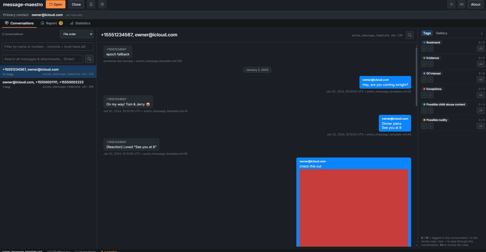
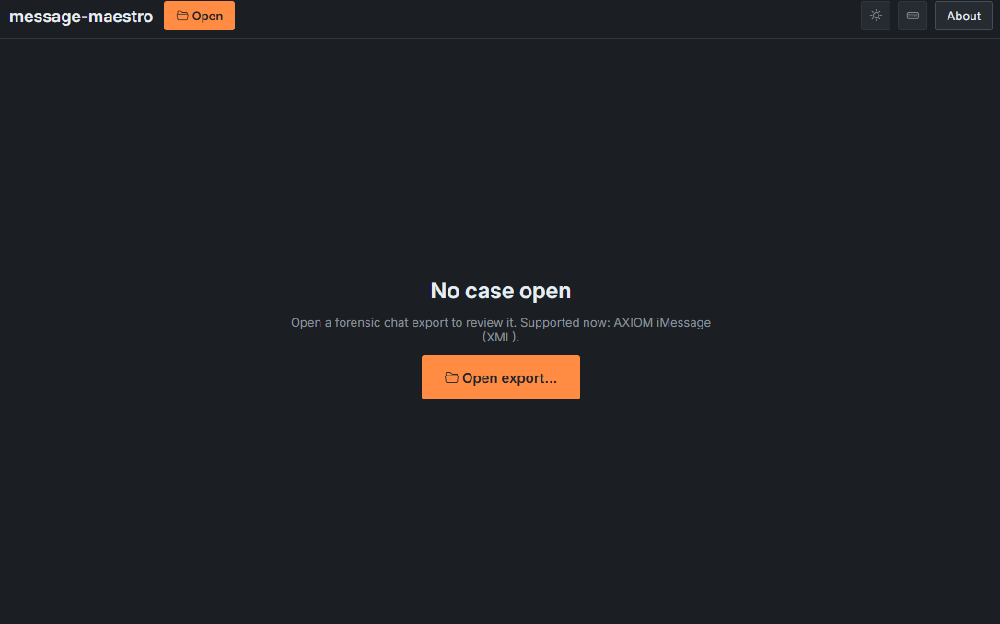
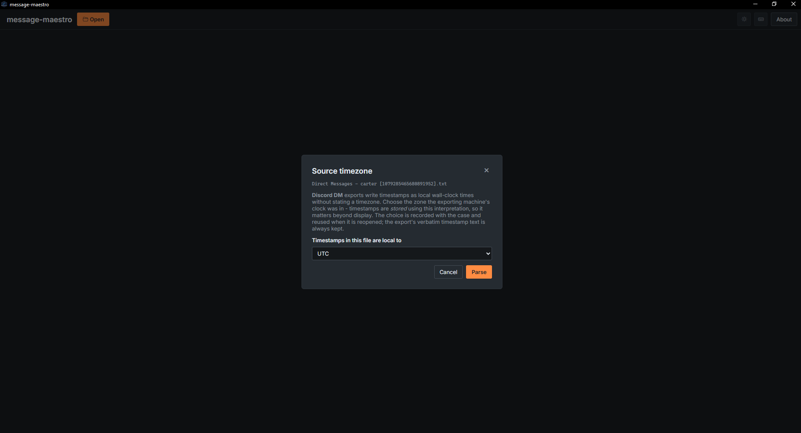
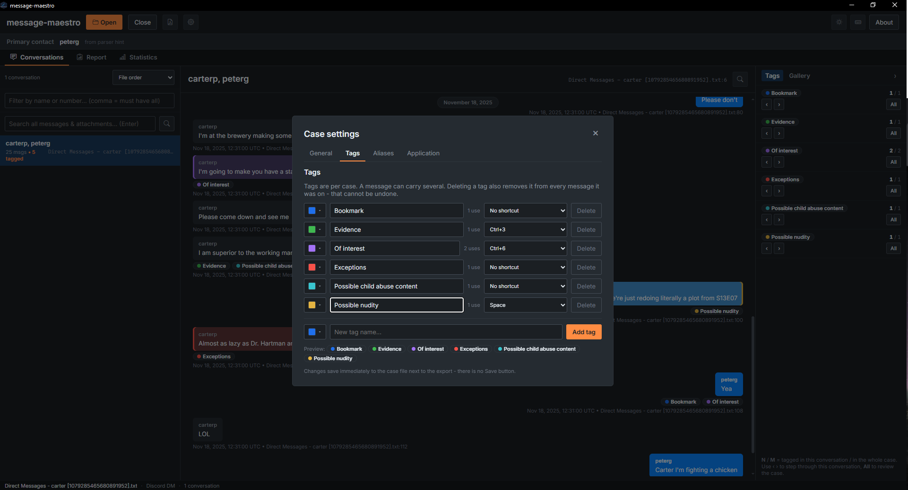
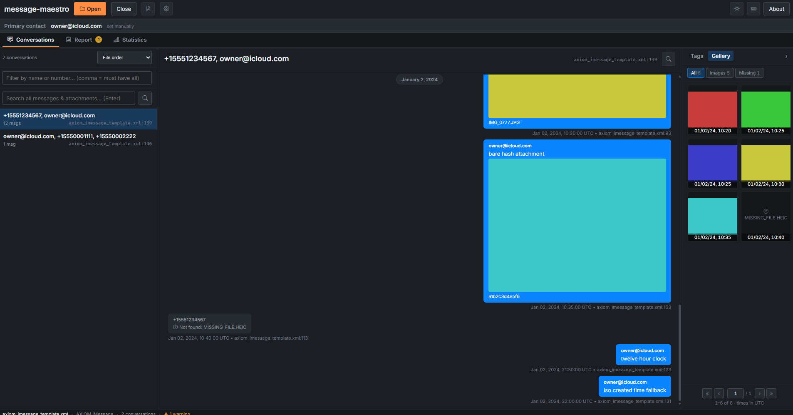
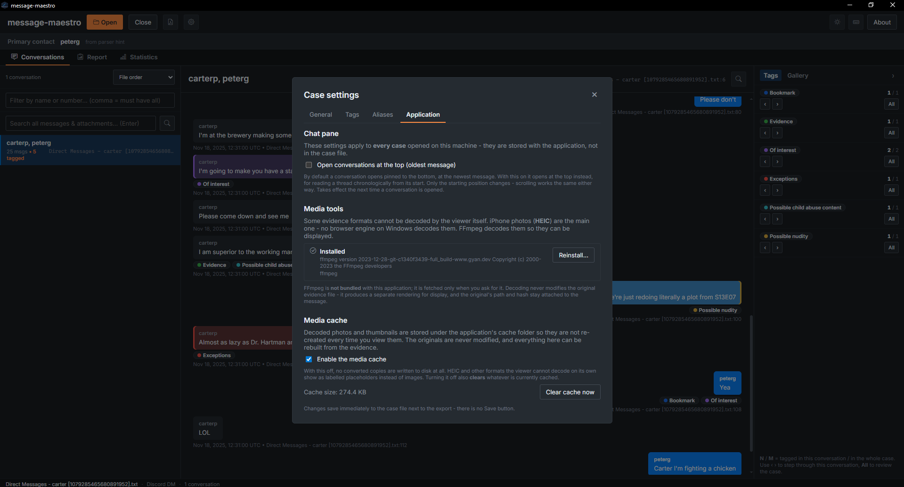
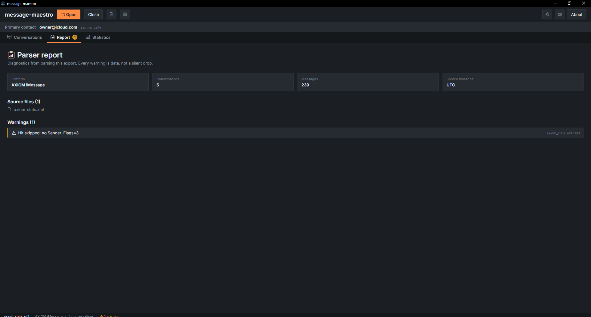
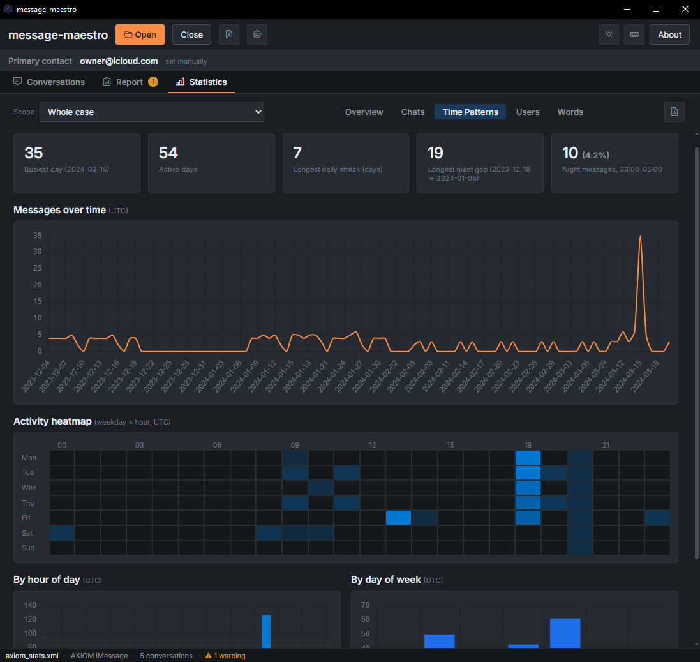
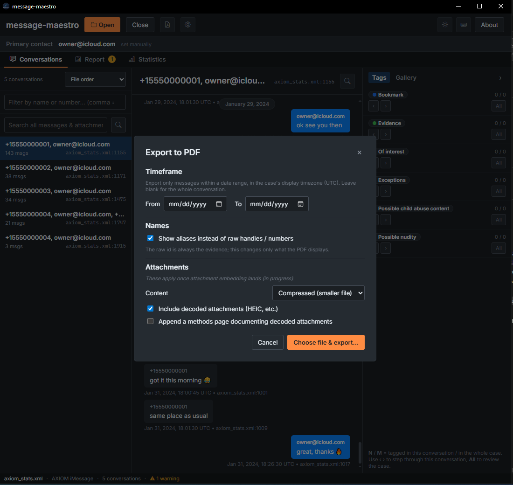

# Message Maestro

Message Maestro is a forensic viewer and tagger for chat-conversation exports. An
examiner opens an export produced by a forensic tool or a platform warrant return
(iMessage, Discord, Kik, Snapchat, Twitter), browses and searches the messages,
tags them, aliases raw handles to readable names, sets the account owner and the
display timezone, reviews per-case statistics, and exports court-presentable PDFs.
It runs entirely offline: the original export is treated as evidence and is only
ever read, every rendered artifact is a labelled derivative with a provenance
manifest, and the app makes no network request except an explicit, confirmed
download of the optional media toolchain.



## Table of contents

- [Message Maestro](#message-maestro)
  - [Table of contents](#table-of-contents)
- [User guide](#user-guide)
  - [Installation](#installation)
  - [Quick start](#quick-start)
  - [Supported formats](#supported-formats)
  - [The main window](#the-main-window)
  - [Opening a case](#opening-a-case)
  - [Browsing conversations](#browsing-conversations)
  - [Searching](#searching)
  - [Tagging](#tagging)
  - [Aliases](#aliases)
  - [The primary contact](#the-primary-contact)
  - [Timezones](#timezones)
  - [Media and attachments](#media-and-attachments)
  - [The media toolchain (ffmpeg)](#the-media-toolchain-ffmpeg)
  - [The Report tab](#the-report-tab)
  - [Statistics](#statistics)
  - [Exporting PDFs](#exporting-pdfs)
  - [Settings reference](#settings-reference)
  - [Where your data lives](#where-your-data-lives)
  - [Keyboard shortcuts](#keyboard-shortcuts)
  - [Troubleshooting](#troubleshooting)
- [Developer guide](#developer-guide)
  - [Run from source](#run-from-source)
  - [Architecture](#architecture)
  - [Repository layout](#repository-layout)
  - [Test fixtures and generators](#test-fixtures-and-generators)
  - [Build and release](#build-and-release)
  - [License](#license)

---

# User guide

## Installation

Message Maestro is a desktop application for Windows, macOS, and Linux.

- **Windows**: run the provided installer (`.msi` or the NSIS `.exe`). The app
  renders in the system WebView2 runtime; the installer bundles Microsoft's
  Evergreen bootstrapper, so machines without WebView2 provision it
  automatically during install.
- **macOS**: open the `.dmg` and drag the app to Applications.
- **Linux**: install the `.deb`, or run the `.AppImage` directly.

No other software is required. The optional media toolchain (for HEIC photos and
video thumbnails) is installed later, from inside the app - see
[The media toolchain (ffmpeg)](#the-media-toolchain-ffmpeg).

If you received the repository instead of an installer, build it yourself -
see [Run from source](#run-from-source).

## Quick start

1. Launch the app. You'll see the empty state with an **Open export…** button.

   

2. Click **Open** (or press `Ctrl+O`) and select the export file - the format is
   detected automatically. Some formats ask one question before parsing (see
   [Timezones](#timezones)).
3. Wait for the parse. Large exports show a progress bar and can be cancelled.
4. Browse conversations in the left sidebar, read messages in the middle, and
   use the right rail for the attachment gallery and tag review.
5. Everything you do - tagging, aliases, choosing the account owner, the display
   timezone - is saved instantly to a small sidecar file next to the export.
   There is no Save button, and closing the app loses nothing.

## Supported formats

The format is detected from the file's content, not just its extension. If
detection ever picks wrong, the open dialog lets you force a specific parser.

| Platform | File | Notes |
|----------|------|-------|
| **AXIOM iMessage** | `.xml` | Magnet AXIOM / IEF XML export. Handles multi-GB files; iMessage and SMS threads with the same contact are merged into one conversation. Timestamps are UTC. |
| **Discord DM** | `.txt` | Plain-text conversation export. Times are wall-clock with no timezone stated, so you are **asked for the source timezone** before parsing. |
| **Kik Messenger** | `.csv` | Warrant-return CSV. If the CSV sits inside its original `RESULT_…` folder tree, the sidecar Gallery log is read too and sent media is resolved from the `content/` folder. The CSV's filename identifies the account owner. |
| **Snapchat** | `.csv` | Warrant-return `conversations.csv`. Multi-volume returns (sibling `Production-*` folder trees) are handled: every `conversations.csv` under the case root is merged and media is located across all volumes. The account owner comes from the "Target username / User ID" line in the file header. |
| **Twitter DM** | `.txt` | PGP clear-signed DM export with per-message UTC offsets. Malformed blocks are tolerated and reported, never fatal. |

Two rules hold for every format:

- **Attachments are never faked.** A referenced file either resolves to the real
  file on disk or is shown explicitly as *unresolved* - the app never invents a
  path.
- **Nothing is dropped silently.** Any record a parser has to skip becomes a
  warning with the exact file and line, listed in the [Report tab](#the-report-tab).

## The main window

With a case open, the window has, top to bottom:

- **Title bar** - Open / Close case, conversation-PDF export, case settings
  (gear), theme toggle, keyboard-shortcut help (`F1`), About.
- **Primary bar** - shows the account owner (primary contact) the case is
  interpreted against.
- **Main tabs** - **Conversations** (the three-pane viewer), **Report** (parser
  diagnostics), and **Statistics** (the analytics dashboard). A badge on Report
  shows the parse-warning count.
- **Status bar** - case facts and a shortcut to the Report tab when there are
  warnings.

The Conversations tab is a three-pane layout: the conversation list (left), the
message view (middle), and the right rail with the **Gallery** (all attachments
of the selected conversation) and **Tags** (review every message carrying a
chosen tag, across the whole case) panels.

## Opening a case

Press `Ctrl+O` or click **Open**. After you pick a file:

- The app announces which parser matched, and lets you override it manually.
- If the format's timestamps carry no timezone (Discord), you are asked which
  timezone the exporting machine's clock was in. This is a documented forensic
  decision - the app never silently assumes your machine's local time - and your
  answer is recorded with the case.

  

- Parsing runs in the background with live progress and a working **Cancel**.
- Reopening the same export later restores your tags, aliases, and settings from
  the sidecar file, and relaunching the app restores the open case without
  re-parsing.

## Browsing conversations

- The **sidebar** lists every conversation with its participants and message
  count; the sort order is selectable (file order, most messages, most recent).
- The **message view** is virtualized - a 40,000-message conversation scrolls
  smoothly. It opens pinned to the newest message by default (switchable to
  oldest-first in **Settings -> Application**).
- Move the selection with `↑`/`↓`; right-click a message for the context menu
  (tags, details).
- **Message details** (right-click -> Message details…) shows everything the
  bubble doesn't: the exact source file and line, the verbatim timestamp text
  before normalization, the raw sender handle, every extra field the parser
  preserved (raw chat ids, message type, flags…), and per-attachment paths with
  a "Show in folder" button. All of it is selectable for copying.
- **Conversation details** (from the sidebar) shows the conversation-level
  extras, including the recorded source-timezone decision.

## Searching

- **In-conversation search**: press `Ctrl+F`, type, press `Enter`. Matches are
  highlighted; `Ctrl+G` / `Ctrl+Shift+G` jump to the next / previous match.
- **Global search** searches every conversation at once and lists results
  grouped by conversation with counts and snippets; clicking a result jumps
  straight to that message.
- Search runs only when you submit (never per keystroke), so it stays fast on
  huge cases.

## Tagging

Tags are the triage vocabulary of a case. A default set (Evidence, Of interest,
Bookmark, …) is seeded into every new case; all of it is editable.



- **Manage tags** in **Settings -> Tags**: create, rename, recolor (eight-color
  palette), and describe tags. Deleting a tag removes it from every message it
  was on, and releases its shortcut - this is confirmed first.
- **Apply tags** from a message's right-click menu (toggle any number of tags
  per message).
- **Shortcuts**: bind `Ctrl+1`…`Ctrl+9` and a `Space` quick-tag to specific tags
  in Settings -> Tags. Bindings are unique in both directions and are stored per
  case.
- **Review by tag**: the right rail's Tags panel lists every message carrying a
  chosen tag across the whole case; clicking one jumps to it in context.

## Aliases

Raw handles (`+15551234567`, `a163f438-82b9-…`) are the evidence, but they are
hard to read. An alias maps one **display name** to one or more raw handles
(**Settings -> Aliases**). Aliases are display-only:

- The raw handle is never discarded - it stays visible in message details, and
  the conversation PDF prints an alias legend mapping every display name back to
  its handles.
- One alias can cover several handles (one person, several numbers/accounts).
- Removing an alias reverts to the raw handles everywhere.

## The primary contact

The **primary contact** is the account owner - the person whose device or
account produced the export. It drives which messages render as *sent* (right,
blue) versus *received* (left), the sent/received statistics, and the
"destination" column of the conversation list.

Some formats state the owner (Kik's filename, Snapchat's header, Twitter's
export owner) and the app sets it automatically. Formats that don't (AXIOM
iMessage) rank the likely candidates and ask you to confirm. You can change the
primary at any time in **Settings -> General**; the change is guarded by a
confirmation because it re-orients the whole case.

## Timezones

Message Maestro keeps two timezone concepts deliberately separate:

- **Source timezone** - what zone the export's *stored* timestamps were written
  in. Most formats state this themselves (AXIOM and the CSV formats write UTC;
  Twitter carries per-message offsets). Only formats with naive wall-clock times
  (Discord) ask you, once, at open time. The decision is recorded and shown in
  conversation details.
- **Display timezone** - what zone times are *shown* in, set per case in
  **Settings -> General** (any IANA zone; default UTC). Storage always stays
  UTC; changing the display zone only changes the rendering, and every rendered
  time states the zone it is in. The statistics time buckets (days, hours,
  heatmap) follow the display zone too.

## Media and attachments



- Images render in the bubble and open in a **lightbox**; videos that the
  viewer can play inline do so, and every video gets a contact-sheet thumbnail.
- The right rail's **Gallery** shows every attachment of the selected
  conversation as thumbnails with timestamps.
- **HEIC photos** (the iPhone default) can't be shown by the viewer directly;
  with the media toolchain installed they are decoded once into a cached
  preview. Every such preview is visibly badged as *converted* - the original
  file is never modified - and message details shows the full conversion
  record: the original's SHA-256, the tool and version, the exact command, and
  the output's SHA-256, so the derivative can be reproduced and verified.
- Attachments the export references but that don't exist on disk are shown as
  explicit *unresolved* entries, with the referenced name copyable.
- The **media cache** (all derived previews) can be inspected, cleared, or
  disabled entirely in **Settings -> Application** - disabling it means "write
  no derived copies of evidence", at the cost of HEIC/video previews.

## The media toolchain (ffmpeg)

**ffmpeg** is a widely used open-source program for decoding images and video.
Message Maestro does not bundle it; it uses it only for:

- decoding HEIC/HEIF photos into viewable previews,
- image thumbnails in the gallery,
- video contact-sheet thumbnails (and the frames used in PDF embedding).

Everything else works without it - unsupported attachments simply show as
labelled placeholders instead of pictures.

Install it from **Settings -> Application -> Media tools**: the app shows the
current status and offers a one-click download. **This is the only network
request the application ever makes**, it happens only when you explicitly click
install, and the downloaded tool's exact version is recorded in every
conversion manifest afterwards. If your machine already has ffmpeg on the
`PATH`, the app finds and uses it without downloading anything.



## The Report tab

Parsing problems are data, not console noise. The **Report** tab shows:

- the source file(s), detected platform, and totals;
- **every parse warning** with its message and exact file:line provenance -
  skipped records, undecodable fields, timezone caveats;
- any conversation that failed to parse as a block, clickable to inspect.

A count badge on the tab and a status-bar teaser make warnings visible without
being intrusive. If the numbers in a case ever look off, this is the first
place to look.



## Statistics

The **Statistics** tab is an analytics dashboard over the whole case or any
single conversation (the scope selector, top left). Every number on screen and
in the statistics PDF comes from one shared calculation, so they can never
disagree. Five sub-tabs:

- **Overview** - headline counts (messages, conversations, participants,
  attachments, tagged, messages without a parseable timestamp), the date range,
  median message length and response time, and top-5 rankings for *most
  messages* and *in most chats*.
- **Chats** - every conversation ranked by volume, with attachments, tagged
  counts, and the primary contact's sent/received split.
- **Time Patterns** - activity cards (busiest day, active days, longest daily
  streak, longest quiet gap, night messages), messages-over-time (long spans
  group days per bar, and say so), a **weekday × hour heatmap**, and hour-of-day
  / day-of-week charts. All in the display timezone.

  

- **Users** - per-participant table: messages, chats, conversations started,
  re-opens (messages after 6+ hours of silence), night share (23:00–05:00),
  questions asked, median response time, words, characters.
- **Words** - top content words (common stop-words removed), top emoji, top
  shared link domains, per-tag counts, and a **word trend**: pick any top word
  and see its per-month usage.

Definitions worth knowing: *night* is 23:00–04:59 in the display timezone; a
*re-open* is any message sent after at least six hours of conversation silence;
a *response* is measured against the immediately preceding message from a
different sender; medians are true medians.

## Exporting PDFs

Two exports, both rendered offline, both written atomically (a cancelled or
failed export never leaves a half-written file):

**Conversation PDF** (the PDF button in the title bar) - a court-presentable
rendering of the selected conversation, with a title page (participants,
primary, date range, timezone statement, alias legend) and one bubble per
message with its provenance line. Options:



- **Date range** - include only messages within the given dates, interpreted in
  the display timezone. Messages without a parseable timestamp are always kept.
- **Use aliases** - print display names (with the legend mapping them back to
  raw handles), or print raw handles only.
- **Attachments: compressed / original / none** - *compressed* embeds
  print-resolution derivatives (and decodes HEIC when allowed); *original*
  embeds the exact original bytes for formats a PDF can carry (PNG/JPEG/GIF)
  and lists everything else by name - never silently re-encoding; *none* lists
  all attachments by name.
- **Include decoded HEIC derivatives** - allow or forbid converted previews in
  the PDF.
- **Methods appendix** - an optional final section documenting every conversion
  performed for this PDF (hashes, tool, exact command), for reproducibility.

**Statistics PDF** (the PDF button in the Statistics tab) - the dashboard as a
typeset report for the current scope: overview, activity, timeline, heatmap,
hour/weekday charts, conversation and participant tables, top words / emoji /
domains, tags. Large tables are capped, and every cap is stated on the page
(nothing is trimmed silently).

## Settings reference

Settings live in one dialog (the gear icon), in four tabs. The first three are
**per-case** (saved in the case sidecar); the Application tab is
**machine-wide**.

**General**
- *Primary contact* - the account owner the case is interpreted against; see
  [The primary contact](#the-primary-contact). Changing it asks for
  confirmation.
- *Display timezone* - the IANA zone all times are shown in; see
  [Timezones](#timezones).

**Tags**
- Create, rename, recolor, and describe tags; usage counts per tag; delete with
  cascade (confirmed).
- Bind or release the `Ctrl+1`…`9` and `Space` tag shortcuts.

**Aliases**
- Create, edit, and remove display-name aliases for raw handles; see
  [Aliases](#aliases).

**Application** (applies to every case on this machine)
- *Open conversations at the top (oldest message)* - by default a conversation
  opens pinned to the newest message; this flips it to oldest-first.
- *Media tools* - ffmpeg/ffprobe status, versions, and the explicit install
  button; see [The media toolchain (ffmpeg)](#the-media-toolchain-ffmpeg).
- *Enable the media cache* - allow the app to write derived previews (decoded
  HEIC, thumbnails, contact sheets). Disabling means no derived copies of
  evidence are ever written; existing derivatives can be cleared with the
  *Clear cache* button, which also shows the cache's current size. Originals
  are never touched either way.

**Theme** - the sun/moon button in the title bar toggles dark (default) and
light themes; the choice persists.

## Where your data lives

- **The export itself** is only ever read - never modified, moved, or deleted.
- **Your case work** (tags, aliases, primary contact, timezone, shortcuts) is
  saved to a sidecar JSON next to the export, named
  `<export name>_maestro.json`, written atomically on every change. Copy it
  with the export to move a case between machines.
- **The media cache** (derived previews with their provenance manifests) and
  the **application settings** live in the per-user application-data directory,
  and the cache can be cleared from Settings at any time.
- **Logs** are plain-text files in the application-data directory, rotated
  daily. Nothing - logs, telemetry, crash reports, anything - ever leaves the
  machine.

## Keyboard shortcuts

| Shortcut | Action |
|----------|--------|
| `Ctrl+O` | Open an export |
| `↑` / `↓` | Move message selection |
| `Ctrl+1…9` | Toggle the tag bound to that number |
| `Space` | Toggle the quick-tag, if one is bound |
| `Right-click` | Message menu: tags, details |
| `Ctrl+F` | Search in conversation |
| `Enter` | Run the search (in the search box) |
| `Ctrl+G` / `Ctrl+Shift+G` | Next / previous search match |
| `Esc` | Close search / deselect message / close dialog |
| `F1` | Show the keyboard-shortcuts list |

The tag hotkeys are per-case bindings (which tag a number toggles is set in
**Settings -> Tags**), so the table names the mechanism, not a specific tag.

## Troubleshooting

- **A photo shows "cannot display" or a placeholder** - it is probably a HEIC
  and the media toolchain isn't installed; see
  [The media toolchain (ffmpeg)](#the-media-toolchain-ffmpeg). If the cache is
  disabled, previews that require conversion are also unavailable by design.
- **A video won't play inline** - iPhone `.mov` files are typically HEVC, which
  the viewer can't decode; the thumbnail still renders (with the toolchain) and
  the file can be opened in your system player from the gallery.
- **An attachment shows as "unresolved"** - the export references a file that
  isn't on disk next to it. The referenced name is shown and copyable in
  message details; nothing was fabricated in its place.
- **Numbers look off / messages seem missing** - check the
  [Report tab](#the-report-tab): every skipped record is listed there with its
  file and line.
- **Times look wrong** - check both zones: the *source* timezone recorded at
  open (conversation details) and the *display* timezone
  (Settings -> General). See [Timezones](#timezones).
- **The wrong parser claimed the file** - reopen and pick the parser manually
  in the open dialog.

---

# Developer guide

## Run from source

Prerequisites: a [Rust toolchain](https://rustup.rs), [Node.js](https://nodejs.org) 20+,
and the [Tauri prerequisites](https://tauri.app/start/prerequisites/) for your OS
(on Linux, the WebKitGTK dev packages; on Windows/macOS the system webview is built in).

```powershell
npm install          # once, to pull frontend deps
npm run tauri dev    # run the app with hot-reload
```

`npm run tauri dev` starts the Vite dev server and the Rust shell together; edits
to Svelte/CSS hot-reload, edits to Rust trigger a recompile. The core crate's
`tests/` tree is excluded from the dev watcher (`message-maestro-core/.taurignore`),
so running `cargo test` does not restart the dev app.

The media toolchain (ffmpeg/ffprobe) is optional at dev time exactly as it is for
users; media-dependent code paths degrade to placeholders without it.

## Architecture

A Cargo workspace of two Rust crates plus a Svelte frontend. `message-maestro-core`
holds all logic - parsers, the case session, statistics, media, and the exporters -
and depends on no UI or Tauri code, so it is tested headless. `src-tauri` is a thin
Tauri shell that wires `#[tauri::command]`s to the core and owns window setup,
capabilities, and the CSP. `frontend/` is the Svelte 5 + TypeScript app, which
reaches Rust only through typed IPC wrappers in `lib/ipc.ts`; the Rust side owns
truth and the webview is a refreshed projection of it. `Cargo.toml` and
`package.json` stay at the root (the `cargo`/`tauri`/npm CLIs resolve their code
dirs from there); everything else is grouped under the three code peers.

## Repository layout

```
Message-Maestro-Rust/
├── Cargo.toml                 # Rust workspace; shared dep versions; release profile
├── package.json               # frontend deps + scripts (dev -> vite frontend, tauri)
├── VERSION                    # canonical version; scripts/version.js propagates it
├── message-maestro-core/      # all logic; no UI/Tauri deps; testable headless
│   ├── build.rs               # stamps the build git commit into the binary
│   ├── .taurignore            # keeps tests/ out of the dev watcher
│   ├── src/
│   │   ├── lib.rs, app.rs, error.rs
│   │   ├── model/             # serde data types (chat, tags, provenance, ...)
│   │   ├── parser/            # one file per format + the detection registry
│   │   └── service/           # session, stats, media/, export.rs, pdf_export.rs,
│   │       │                  #   stats_pdf.rs, case, task (Progress + cancel), ...
│   │       └── *_template.typ # Typst templates for the PDF exporters
│   └── tests/                 # integration tests against the public API + fixtures
├── src-tauri/                 # Tauri shell (thin Rust); the only crate linking Tauri
│   ├── src/{main.rs,lib.rs,commands.rs,dto.rs,error.rs}
│   ├── capabilities/          # least-privilege permission grants
│   ├── icons/                 # generated by `tauri icon`
│   └── tauri.conf.json
├── frontend/                  # Svelte frontend (Vite root)
│   ├── index.html, vite.config.ts, svelte.config.js, tsconfig.json
│   └── src/
│       ├── App.svelte, main.ts
│       ├── styles/{theme.css,global.css}      # design tokens
│       ├── lib/
│       │   ├── ipc.ts, log.ts, theme.ts       # IPC, console->Rust bridge, theming
│       │   ├── components/                     # reusable (Icon, dialogs, ...)
│       │   └── views/                          # screens: ChatView, Sidebar,
│       │       │                               #   StatisticsView, RightRail, ...
│       │       └── {stats,rail,settings}/     # dashboard panels, rail, settings tabs
│       └── assets/            # fonts, license texts bundled by Vite
├── docs/                      # reference material (original Python parsers, samples)
├── scripts/                   # version.js, credits, and fixture generators
├── .github/workflows/         # CI: fmt + clippy + test + svelte-check + bundle, 3 OSes
├── analysis_todo.md           # in-repo backlog
├── LICENSE.txt
└── STANDARDS.md               # the workspace's engineering standards
```

## Test fixtures and generators

Committed fixtures under `message-maestro-core/tests/fixtures/` are small and
snapshot-tested; large or media-carrying test data is generated on demand into
the gitignored `testdata/` directory:

```powershell
npm run gen-testdata   # ~300 MB synthetic AXIOM export (perf / load testing)
npm run gen-viewable   # small AXIOM case with real media (HEIC, PNG incl. eXIf
                       #   orientation, inline MP4, out-of-scope MOV)
npm run gen-stats      # hand-scripted case where every statistic has a known
                       #   expected value (printed by the script)
```

`cargo run -p message-maestro-core --example stats_fixture_check` parses the
stats fixture through the real stack and prints the computed numbers, and also
renders `testdata/stats_report_preview.pdf` for eyeballing the statistics PDF.

## Build and release

```powershell
npm run tauri build
```

Produces the platform bundle under `src-tauri/target/release/bundle/` (`.msi` +
NSIS `.exe` on Windows, `.dmg` + `.app` on macOS, `.deb` + `.AppImage` on Linux).
On Windows the app uses the system WebView2 runtime; the installer bundles the
Evergreen bootstrapper so older machines self-provision. CI builds and tests for
Windows 11 x64, Linux x86_64, and macOS Apple Silicon on every push and PR
(formatting, clippy with warnings denied, `cargo test`, `svelte-check`, and a full
bundle build). The version lives in `VERSION` and is propagated into
`Cargo.toml`, `package.json`, and `tauri.conf.json` by `node scripts/version.js`.

## License

Proprietary, all rights reserved - copyright Steven R. Schiavone. See
[LICENSE.txt](./LICENSE.txt). Internal-use grants are extended, independently, to
Iceberg Forensics LLC and the Westchester County District Attorney's Office High
Tech Crime Bureau for their own forensic work; the grants do not include
redistribution, sublicensing, or inclusion in client-facing deliverables.

Bundled third-party components ship under their upstream licenses. The **Inter**
font and **Noto Emoji** (both SIL Open Font License 1.1) and **Bootstrap Icons**
(MIT) are bundled; the **Tauri / Svelte / Vite** toolchain and the other Rust and
JS dependencies are MIT or Apache-2.0. Noto Emoji is embedded in the core crate to
render emoji glyphs in the PDF exports. The About panel surfaces the app license,
the Inter and Noto Emoji licenses, and a generated third-party bundle - all shipped
inside the app.

---

This project follows [STANDARDS.md](./STANDARDS.md).
